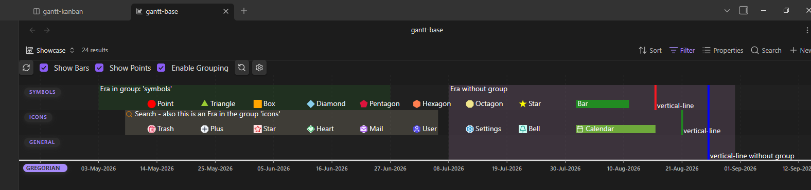
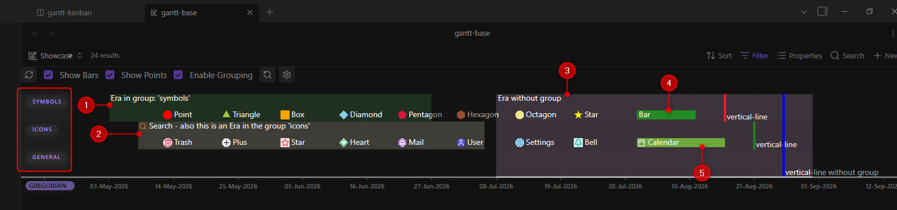
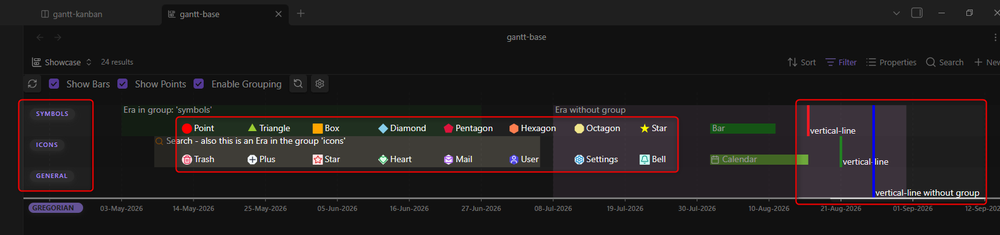

# Event properties



The screenshot shows all possible types of events, and some randomly chosen icons.
In the chart, each element above the calendar axis represents an event defined in a Markdown note.

## Features & Structure

- **Events:** Each point or bar in the timeline corresponds to an event. Events are split into timestamps and timespans.
  - **Bars:** Represent time spans.
  - **Points / Symbols:** Represent specific points in time or milestones.
- **Decentralized in Frontmatter:** Events are defined directly within the YAML properties of your Markdown files.
- **Structuring:** Events can be organized, filtered, and sorted by groups and custom calendars.
- **Flexible Visibility:** Groups, calendars, time spans, and individual points can be shown or hidden independently.
- **Custom Styling:** Points in time can be customized with icons from Obsidian's cache and custom colors.
- **Interactivity:**
  - Mouseover displays relevant metadata in a tooltip (Desktop).
  - Clicking an event directly opens the source note—optionally jumping to a specific heading.
  - Full navigation via drag & zoom (mouse wheel on Desktop, touch gestures on mobile devices).

## Populating Your Gantt Chart / Timeline

See below for more in-depth [[04-events#Understanding-Event-Properties|examples]].

To display one or more notes as events in your timeline, add the corresponding properties to the YAML frontmatter of your Markdown file:

```yaml
gantt-item: true           # Marks the note as an event
gantt-start: 2026-01-01    # Start date / point in time
gantt-end: 2026-01-05      # Optional: end date (fallback: gantt-start) - marks event as timespan if given
gantt-name: "My Project"   # Optional: name (fallback: filename)
gantt-group: "Development" # Optional: group (fallback: 'general')
```

# Understanding Event Properties

## Calendar

Each event can be related to one calendar only. Assigning an event to more than one makes no sense since they could appear at different timestamps. Dates defined in the event note will be interpreted according to this calendar.

To add a calendar to an event use the following property:

```yaml
gantt-calendar: gregorian | (omit or leave empty for default calendar - configurable in settings)
```

> [!info] Default value
> This frontmatter property is *optional*. Omit or leave empty to use default calendar, which is configurable in settings

## Timespan Events


Any event with start- and end-date property is defined as a timespan.
There are two types of timespan events:

- `'bar'`: Bars are shown as horizontal rectangles. See markers (4) and (5) in the screenshot: (4) is named 'Bar' and set into group 'symbols', while (5) is placed into group 'icons.'

- `'era'`: Eras are shown as semi-transparent rectangle behind all other events. They can be placed in a group or span the entire height of the chart (if no group is defined). See markers (1), (2) and (3) in the screenshot. (1) is placed in group 'symbols', (2) inside 'icons', while (3) has no group.

```yaml
gantt-start: 2026-08-27
gantt-end: 2026-08-30
gantt-symbol: bar | era | (omit or leave empty to default to 'bar')
```

## Timestamp Events


Timestamp events are defined by adding a start-date to any event. Omit the end-date or leave it empty.

There are 8 different symbols usable for a normal timestamp event. All of these function the same way, the only thing that changes is the SVG graphic. See central box of the screenshot.

- `point` | `triangle` | `box` | `diamond` | `pentagon` | `hexagon` | `octagon` | `star`

But they were all betrayed - for a ninth symbol was made to betray them all. See right box of the screenshot. This symbol was added to create separators and/or markers for special days like "today". Similar to `era` above, it spans the entire height when not placed into a specific group.

- `vertical-line`

```yaml
gantt-start: 2026-08-27
gantt-symbol: point | triangle | box | diamond | pentagon
  | hexagon | octagon | star | (omit for default symbol - configurable in settings)
```

## Groups

All events can be grouped. Whether the group is defined in settings does not matter at this point. The events in the showcase screenshot are sorted into the groups `symbols`, `icons`, and `general` (see left side of screenshot).

To group an event use the following property. Omit or leave empty for default group 'general' - configurable in settings)

```yaml
gantt-group: any group
```

> [!info] Additional options
>
> Defining groups in the plugin settings gives you multiple extra options.
> - groups can have a default color for events
> - group visibility can be toggled
> - groups can be sorted to influence order of appearance on charts

## Color

Each event can be colored. `era` events will add transparency to the chosen color. The color value can be a human-readable CSS color like for example `red`, `forestgreen`, `teal` - or a 6-digit hex value starting with `'#'`.

To color an event use the following property:

```yaml
gantt-color: yellow | '#FFFF00' | (omit for default color - configurable in settings)
```

> [!info] Color priority
>
> There are multiple sources for event color. Starting with the highest priority, the plugin uses the first it finds.
> - event property `gantt-color`
> - default color for group in property `gantt-group`
> - default color for calendar in property `gantt-calendar`
> - global fallback color (always exists)

## Icons

Each event except `vertical-line` can be decorated with an SVG icon. The icons are pulled from Obsidian's cache. To add and color an icon use the following properties. Remember to rename the properties to your liking.

```yaml
gantt-displayIcon: heart
gantt-displayIconColor: red | (omit or leave empty for default color - configurable in settings)
```

## Special dates

Right now, there is one special keyword: `today`. This will be interpreted as your local current day. Adding this to an event will obviously show it at different timestamps each day.

You can add a fixed amount of days to it. To achieve this you can use the following properties:

```yaml
gantt-start: 2026-08-20
gantt-end: today+5
```

# Overview

The following table lists all available properties you can use in your notes:

| Property                 | Type / Values                              | Optional? | Default / Fallback                                  | Description                                                               |
|:-------------------------|:-------------------------------------------|:----------|:----------------------------------------------------|:--------------------------------------------------------------------------|
| `gantt-item`             | Boolean                                    | No*       | `true`                                              | Marks the note as an event target for the plugin.                         |
| `gantt-start`            | String                                     | No        | *None* (Note will be ignored without a start value) | Start date or start value of the event.                                   |
| `gantt-end`              | String                                     | Yes       | Value of `gantt-start`                              | End date of the event. If identical to start value, a point is displayed. |
| `gantt-name`             | String                                     | Yes       | File name without extension (`file.basename`)       | Name of the event in the timeline and tooltip.                            |
| `gantt-calendar`         | String                                     | Yes       | Default calendar                                    | Determines the assigned calendar type.                                    |
| `gantt-group`            | String                                     | Yes       | `'general'`                                         | Group used for row layout and structuring.                                |
| `gantt-color`            | Color (e.g. `#ff0000`, `red`)              | Yes       | Group color → Calendar color → Default              | Overrides the background color of the event individually.                 |
| `gantt-displayIcon`      | String ([Lucide Icon](https://lucide.dev)) | Yes       | *None*                                              | Displays an icon on the event.                                            |
| `gantt-displayIconColor` | Color (e.g. `#ff0000`, `red`)              | Yes       | Default icon color                                  | Sets the color of the icon.                                               |
| `gantt-symbol`           | `bar`, `point`, `icon`, `diamond`          | Yes       | `bar` (time span) or `point` (point in time)        | Sets the visual representation format of the event.                       |
| `gantt-linkToHeader`     | String                                     | Yes       | *None* (Jumps to top of file)                       | Links directly to a specific heading when clicked.                        |

\*: Property `gantt-item` may be set to optional in the settings.

*All of these can be renamed to your liking*.
