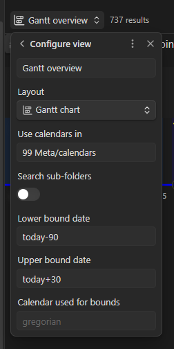

# Bases Integration

Bases offer an integrated way to visualize and manage your timeline data directly within Obsidian views alongside standard table layouts.

## Overview & View Configuration

When creating a new Base view, set the **Layout** dropdown to **Gantt chart**. This opens the view configuration panel with chart-specific options:

- **View Name:** Set a custom display title for the view tab (e.g., `Gantt overview`).
- **Use calendars in:** Specify the target folder path where your custom calendar definitions are stored (e.g., `99 Meta/calendars`).
- **Search sub-folders:** Enable this toggle if your calendar files are organized across nested subdirectories.
- **Lower bound date & Upper bound date:** Constrain the default visible range of your chart. Supports relative expressions like `today-90` or `today+30` as well as fixed dates.
- **Calendar used for bounds:** Select which calendar system is used to interpret the lower and upper bounds.

## Displaying Properties in Tooltips

Properties configured in your Base view setup automatically extend the interactive tooltips on the chart:

- Any file property selected for display in the Base view settings will appear inside the hover tooltip when inspecting an event on the timeline.
- This allows quick previewing of metadata (such as status, assignees, or custom tags) without opening the note.

## Filtering Events & Groups

Use standard Base filters to control event visibility on the chart:

- **Filter by Calendar:** Isolate events belonging to specific custom calendars.
- **Filter by Group:** Focus on individual lanes or project phases by filtering on your `gantt-group` properties.
- **Dynamic Views:** Combine multiple filters to create tailored timeline dashboards for different projects or campaign arches.

> [!tip] Quick-Edit Workflow
> Pair your **Gantt chart** view with a standard **Table** view in the same Base.
>
> Switching to the Table view lets you quickly edit dates, groups, colors, and frontmatter properties across hundreds of events in bulk, with all changes reflecting instantly when you switch back to the Gantt chart view.
