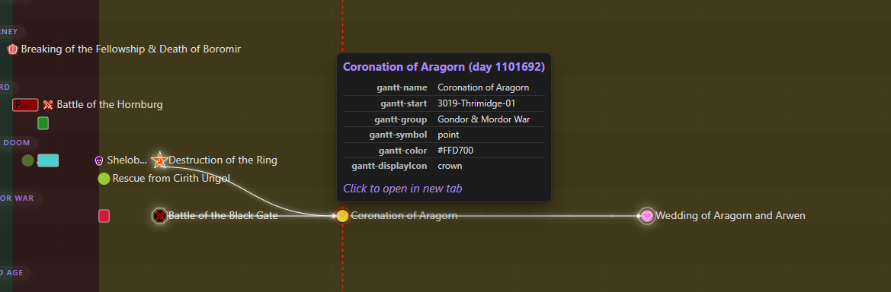

[< Back to event overview](events/)

---

Events can be linked sequentially to show cause, effect, or task order.
The frontmatter properties `gantt-predecessors` and `gantt-successors` are meant to build these linear connections.

Both properties accept a list of links to other event notes.

When activated in settings and hovering over an event:

- **Predecessors**: Draws arrows from its predecessors to the **left edge** of the current event.
- **Successors**: Draws arrows from the current event to the **left edge** of its successors.
- Hovering over an event also highlights its connected dependency chain.

> [!example]+ Event example: "Aragorn's coronation"
> ```yaml
> ---
> gantt-predecessors:
>   - "[[Destruction of the One Ring & Fall of Sauron]]"
>   - "[[Battle of the Morannon (Black Gate)]]"
> gantt-successors:
>   - "[[Wedding of Aragorn & Arwen]]"
> ---
> ```
> 

---

> [!info]- Property traits
> - Both properties are of type `list`; their usage is optional.
> - You can rename them to your liking, see [[plugin-settings#Event Frontmatter Properties|Plugin Settings > Event Frontmatter Properties]].
>
> **Troubleshooting**: If arrows or highlights do not appear, verify that the feature is enabled in [[plugin-settings#Event overlay|Plugin Settings > Event overlay]].


