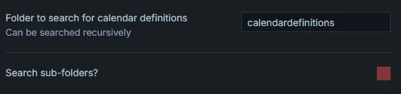
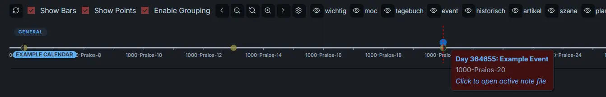

This guide walks you through setting up your first Gantt chart in Obsidian.

## Fundamentals and first steps

The plugin renders timeline views directly inside Markdown notes using custom code blocks or Bases. At its simplest, a chart requires only a basic code block:

````markdown
```gantt-this
```
````

Alternatively, create a Base of type `'Gantt this'`.

Without calendar and events, the chart will render nothing. Follow these steps below to populate your timeline.

### Define a calendar

First, choose any folder in your vault to dedicate to calendars, the following examples uses `calendardefinitions`. In the settings you can tell the plugin to only look for calendars in this folder. Then, create a new note inside the folder.

Calendar definitions are stored in YAML code blocks inside dedicated Markdown notes. Feel free to copy any example of our [[example-calendars/index]], we'd suggest [[gregorian-calendar|Gregorian Calendar]].

There are many options to a calendar definition, most of which are optional, but this should give you a quick calendar you can start from and adjust to your needs.

> [!warning] Property Matching
> The frontmatter value (`gantt-calendar-definition`) and the `id` field inside the YAML code block must match **exactly** (case-sensitive).
>
> The frontmatter property is used to quickly filter files, while the YAML property will be parsed for the plugin.

Next, configure the plugin settings to locate your calendar and event files:

(1) Set Calendar Folder: Open settings and specify your calendar definitions folder (e.g. `calendardefinitions`). If left blank, the plugin searches your entire vault root.


(2) Enable Sub-folder Search: Enabling "Search sub-folders" for events is recommended, as event notes are typically spread across different vault folders.


(3) Add the Calendar ID: Under the Calendars section in settings, click the + button and enter your calendar ID (`my-first-calendar`). Here you can also toggle visibility and set a default color (e.g., green).


### Define an Event

Now, create an event note. Add YAML frontmatter to any Markdown file in your vault:

````markdown
---
gantt-calendar: my-first-calendar
gantt-start: 1000-01-20
---
````

This creates an event on the 20th day of the first month in the year 1000 for `my-first-calendar`.

### Create a chart

Finally, we need to add a Gantt chart to one of our notes. As mentioned above create a new note and add a code block of the gantt-this type like this:

#### Option 1: Via Bases

Create a new base view and set its view type to `Gantt this`.

#### Option 2: Via Command / Ribbon Icon

1. Click the ribbon icon or open the command palette and select: `Gantt this: Open code block creator`.
2. The modal guides you step-by-step through the configuration:

- **Folder for Events:** Specify where the plugin should search for notes with event data (includes a toggle for
  recursive search in subfolders).
- **Folder for Calendars:** Specify where custom calendar definitions are stored.
- By default, the folder of the currently active file is suggested for both.

3. At the bottom of the modal, you can copy the generated code block or insert it directly at your current cursor
   position.

#### Option 3: Manually in the Editor

Simply paste the following code block into any Markdown file:

````markdown
```gantt-this
```
````

After it renders you should see this when you hover your mouse over the blue point which represents the event:



Congratulations! You got your first calendar and event running and displayed!

You might like to take a look at:

- [[calendars|Calendars]]
- [[events/index|Event Properties]]
- [[plugin-settings|Plugin Settings]]
- [[faq|FAQ]]
